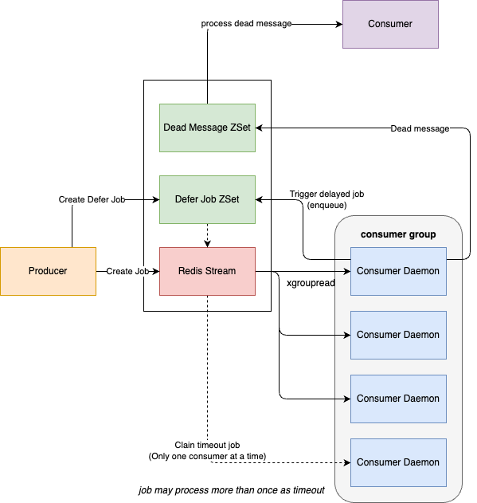

> This project is inspired by [arq](https://github.com/samuelcolvin/arq).
> Not intentionally dividing the community, I desperately needed a redis queue based on redis stream for work reasons and just decided to open source it.
>
> You should also consider [arq](https://github.com/samuelcolvin/arq) as more of a library: https://github.com/samuelcolvin/arq/issues/437

# brq



## Prerequisites

Redis >= 6.2, tested with latest docker image

## Install

`pip install brq`

## Feature

> See [examples](%22./examples%22) for runnable examples.

- Defer job
- Automatic retry job
- Dead queue
- Multiple consumers

## Echo jobs overview

### Producer

```python
import os

from brq.producer import Producer
from brq.tools import get_redis_client, get_redis_url


async def main():
    redis_url = get_redis_url(
        host=os.getenv("REDIS_HOST", "localhost"),
        port=int(os.getenv("REDIS_PORT", 6379)),
        db=int(os.getenv("REDIS_DB", 0)),
        cluster=bool(os.getenv("REDIS_CLUSTER", False)),
        tls=bool(os.getenv("REDIS_TLS", False)),
    )
    async with get_redis_client(redis_url) as async_redis_client:
        await Producer(async_redis_client).run_job("echo", ["hello"])


if __name__ == "__main__":
    import asyncio

    asyncio.run(main())
```

### Consumer

```python
import os

from brq.consumer import Consumer
from brq.daemon import Daemon
from brq.tools import get_redis_client, get_redis_url


async def echo(message):
    print(message)


async def main():
    redis_url = get_redis_url(
        host=os.getenv("REDIS_HOST", "localhost"),
        port=int(os.getenv("REDIS_PORT", 6379)),
        db=int(os.getenv("REDIS_DB", 0)),
        cluster=bool(os.getenv("REDIS_CLUSTER", False)),
        tls=bool(os.getenv("REDIS_TLS", False)),
    )
    async with get_redis_client(redis_url) as async_redis_client:
        daemon = Daemon(Consumer(async_redis_client, echo))
        await daemon.run_forever()


if __name__ == "__main__":
    import asyncio

    asyncio.run(main())
```

## Develop

Install pre-commit before commit

```
pip install pre-commit
pre-commit install
```

Install package locally

```
pip install -e .[test]
```

Run unit-test before PR

```
pytest -v
```
